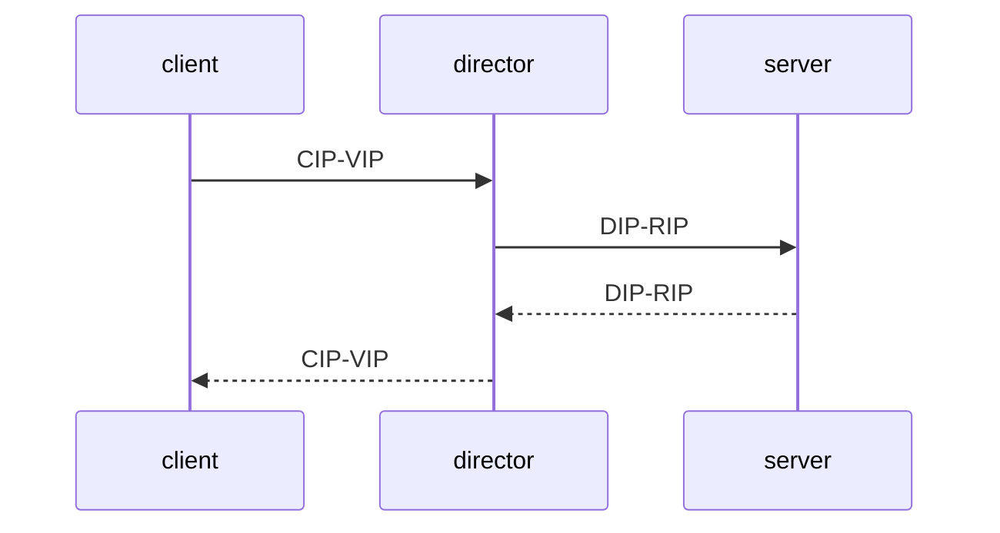
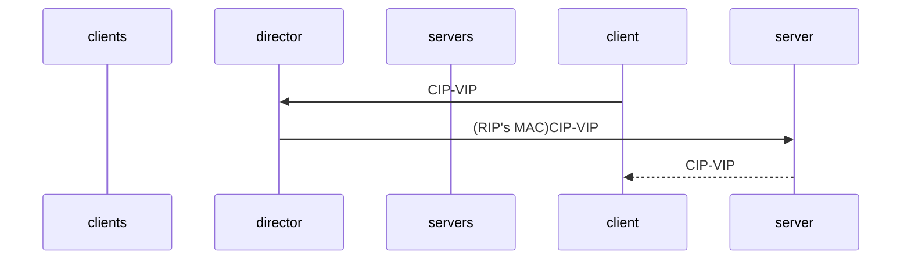
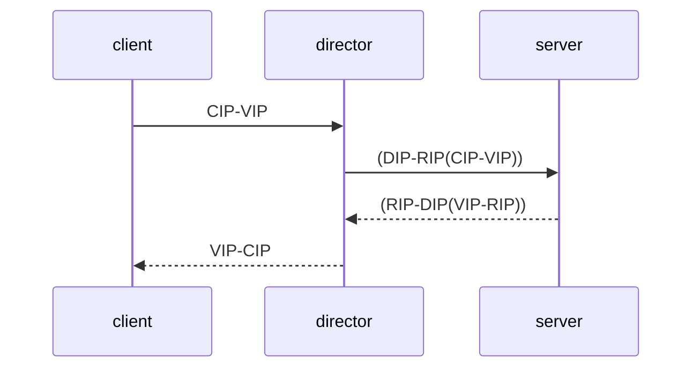

# LVS

## 基于LB的集群
###  简单拓扑

* LB: 负载均衡器；IP；转发，不做三次握手；保证三次握手到四次分手不可分割；
* CIP: Client IP;
* VIP: Vitual IP;
* DIP: Director's IP;
* RIP: Real IP;

#### NAT
### S_NAT
数据包过路由器时，修改源的IP地址。

### D_NAT
数据包过路由器时，修改目标的IP地址。

client 请求server的过程为DNAT，server回复client的过程为SNAT。

基于网络层

I/O 瓶颈：带宽是不对称的，下行的速度是大于上行的速度的。(请求往往比较小，通常可能只包含几十k的请求头，而返回通常数据量比较大，包含多媒体数据)。

#### DR

直接路由模型

LB只处理上行数据，分发给real-server，real-server处理完数据后直接返回给客户端，以解决LB上NAT的I/O瓶颈问题。

改MAC地址的行为要求LB和real-server在同一网段下，否则如果超过一跳，则会导致修改的MAC地址被替换。这是基于MAC地址的欺骗。类似于网关的方式。

这里要求real-server默认网关指向运营商（ISP），且拥有公网IP地址PIP。

### TUN

tunnel，隧道；点对点的方式。类似于VPN。

## 调度
### 静态调度：
* rr
* wrr
* sh
* dh

### 动态调度
* lc： 最少连接
* wlc： 加权最少连接；
* sed： 最短期望延迟；
* nq： never queue；
* LBLC：基于本地的最少连接
* DH：
* LBLCR：

## ipvsadm